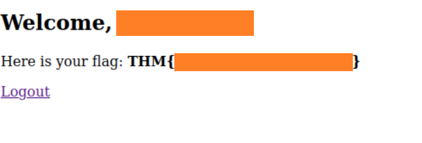

## The Challenge

I understand this is a Burp challenge, but my main focus was on retrieving the flag as efficiently as possible. After encountering issues with the provided machine, I decided to take a completely different approach.

This challenge involves bypassing a custom RSA-encrypted login system to retrieve a flag.

### Prerequisite
```
pip3 install pycryptodome
```
### How I Solved It

After analysing the encryption flow and reviewing the provided keys, I replicated the login process in Python. A vulnerability in the login logic allowed me to bypass authentication (you can probably guess what it was from the next script).

The post-login destination, `dashboard.php`, was identified by inspecting the JavaScript logic. After a successful login, I used the `PHPSESSID` cookie to access that page and retrieve the flag.

### Scripts Used (in order):

1. **`brute_force.py`**  
   Randomly brute-forces username/password combinations using `rockyou.txt`.

2. **`sql_injection_test.py`**  
   Uses a username to test crafted payloads that exploit the login logic.

3. **`fetch_payload.js`**  
   JavaScript `fetch()` command to simulate login in the browser using a working encrypted payload.

4. **`dashboard.php`**  
   Accessed after successful login using the session cookie to retrieve the flag.

### Supporting File:

- **`keys.py`**  
  Contains the RSA key pairs used for encryption and decryption.

Thank you for reading, happy hacking, and until next time!
  
_Written on May 31, 2025_


